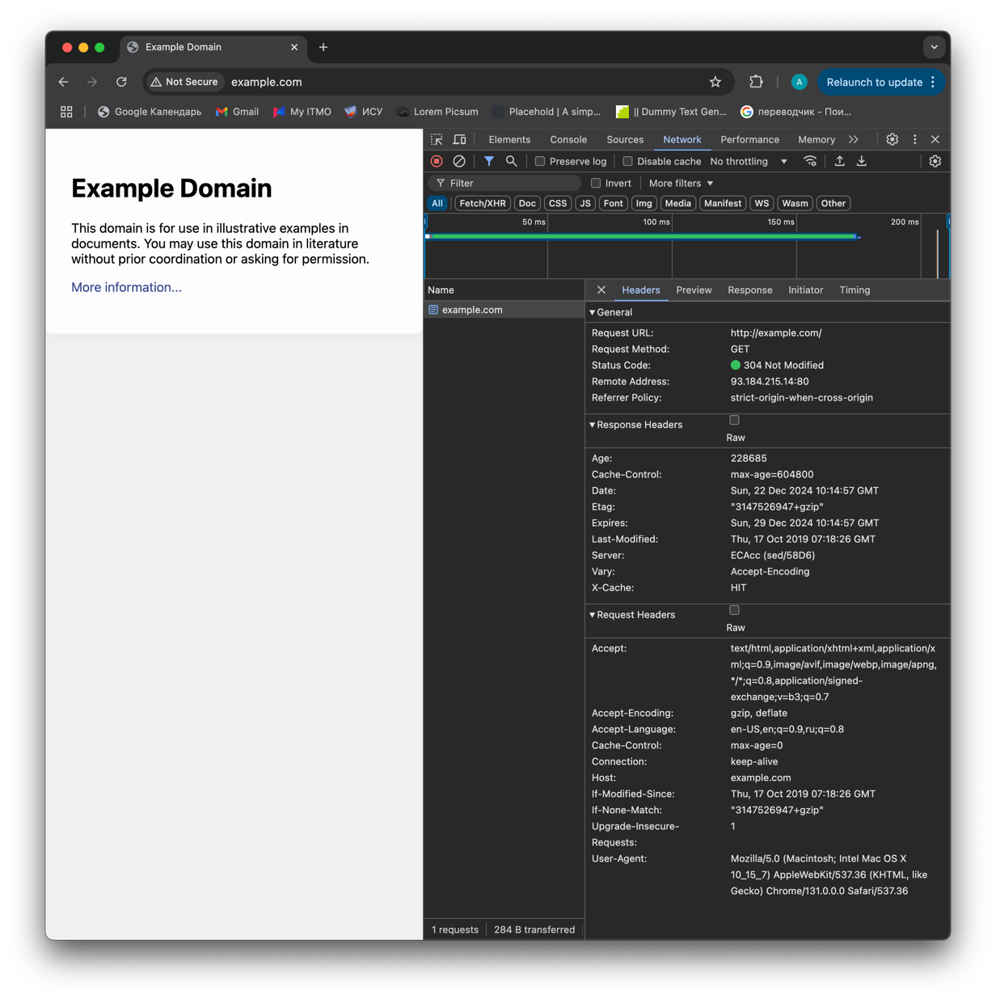

# Лабораторная работа 1

## Тема - использование API для сбора информации

# Теоретический материал

- протокол HTTP
- что такое REST API
    - GET-POST-PATCH-PUT-DELETE
    - Аутентификация
    - json
- Библиотека Request

# Материалы для объяснения

**Протокол HTTP**

Если открыть браузер и перейти по ссылке http://example.com, мы получим веб страницу.
284 байта информации прошли по интернету от сервера до нашего компьютера и браузер
нарисовал на экране этот текст. Давайте разберемся, что произошло.

Для начала, определим понятия:

- сервер: какой-то компьютер, который предлагает какой-то сервис
- клиент: устройство-потребитель сервиса
- интернет: сеть, позволяющая передавать информацию от клиента к серверу и наоборот

Чтобы найти дом на карте, мы используем его адрес. Точно так же, чтобы найти компьютер
в интернете, мы используем ip (internet protocol) адрес. Опустим детали и рассмотрим,
что произошло между клиентом и сервером, когда мы решили перейти по ссылке
http://example.com.

1) Клиент узнал адрес сервера
2) Клиент сообщил серверу, что хочет воспользоваться его сервисом (сделал запрос)
3) Сервер получил запрос клиента, "обслужил" его и отправил ответ
4) Клиент получил ответ и отобразил его нам

Чтобы лучше понять произошедшее, нажмите f12, перейдите в раздел networking и обновите
страницу. Мы можем видеть все ответы, которые мы получили от сервера. Это и есть
основа HTTP (Hyper Text Transfer Protocol).



И так, HTTP - это протокол, который используется для обмена информацией в интернете. 
Он описывает в простом виде то, как и в каком виде можно передать и получить 
информацию. Одна из особенностей HTTP - отсутствие отслеживания "состояния" вашего 
общения. Представьте, такую ситуацию: вы разговариваете с человеком, но он не помнит 
ваших предыдущих фраз и своих собственных ответов. Примерно так и работает 95% интернета.

Тогда как вообще работает интернет. Для того чтобы создать http запрос, 
вам нужно несколько вещей:
- Адрес, куда вы отправите запрос
- HTTP метод
- Заголовки
- Тело запроса

С адресом мы уже разобрались. Остались методы, заголовки и тела. 

## Метод

Методы описывают действие, которое мы хотим совершить. Будь то "посмотреть видео" или 
"оставить комментарий", все это описывается одним из HTTP методов. 
HTTP предназначен для описания манипулирования информацией. Первым появился метод GET. 
Его предназначение - получить информацию. 

# Практическое задание

Я предоставляю API с 4 заданиями и описанными эндпоинтами
Студены должны зарегистрироваться и получить свой API-токен, который они будут
использовать для аутентификации далее
На API будет действовать rate-limiter и случайно могут выдаваться ошибки - симуляция
нагруженности сервера. Студенты должны учитывать это в своем коде. Также от них
ожидается написание собственных юнит-тестов.

Задание 1: выполнить все виды REST запросов на данных.
Задание 2: отсортировать 100 массивов с числами.
Задание 3: обыграть бота в крестики-нолики 50 раз.
Задание 4: интеграция с внешним API. Система запрашивает данные о курсе валюты N в
дату D, ожидает ответ. Повторить 50 раз.

# Реализация системы

Я арендую сервер и разверну бэкэнд на джанго и реверс-прокси для поддержки https и
таймаутов.

# Описание API эндпоинтов

```
/ - описание работы и задач 
/lab1 - потенциально можно будет расширять API
  /task1/ - принимает все виды запросов, необходимо создать каждый
  /task2/
    [GET] - возвращает описание задачи и первый массив
    [POST] - принимает отсортированный массив, возвращает новый массив
  /task3/
    [GET] - возвращает описание задачи и формат взаимодействия
    [POST] - принимает шаг студента, возвращает состояние доски после своего шага
  /task4/
    [GET] - возвращает описание задачи, нормер испытания, N и D
    [POST] - принимает курс валюты. Ответы: 202 ok, 409 err
  /status - отображает количество решенных задач аккаунта
  /reset
/auth - djoser аутентификация
  /register/
  /token/login/
/test/ - эндпоинт для юниттестов. Возвращает код ошибки
  /401/
  /404/
  /408/
/admin/ - можно будет получить спискр студентов, их прогресс, так далее
 ```

# Баллы

Общее количество - 15 баллов

За каждое успешно выполненное задание студент получает по 2 балла, итого 8
Оставшиеся 7 баллов начисляются за качество кода:

- Организация кода по файлам, нэйминг переменных
- Наличие, качество тестов и error-handling
- Отсутствие code smells
- Обращение с секретами
- Обращение с GIT
- Алгоритмическая сложность решений
- Внешние зависимости: эта работа не предполагает использование внешних библиотек

# Текст задачи

HTTP - hyper text transfer protocol - то, как работает интернет.
REST
JSON
API - application programming interface, <рассказать про апи>

--- ПРИВЕСТИ ПРИМЕР ХТТП ЗАПРОСОВ ---

```python

```

Документация реквестов - дока

Теперь изучим задачу

Вам предстоит подключиться к моему api по адресу https://oopyat.duckdns.com/ и
выполнить ряд заданий. Система будет запоминать ваш прогресс.

**Задание 0:**
Вы должны зарегистрироваться в этой системе. Для этого вы должны создать POST запрос
на эндпоинт https://oopyat.duckdns.com/auth/register/. Ваш запрос выглядеть следующим
образом

```http request
POST https://oopyat.duckdns.com/auth/register/
Content-Type: application/json

{
"isu": number,
"full_name": text,
"group": text,
"password": (8+ characters)
}
```

Далее вам требуется заполучить токен для работы с API. Токен - это способ приложению
идентифицировать вас приложению. Как мы знаем, REST не следит за тем, кто, когда и в
какой последовательности отправляет запросы. Для того чтобы сервер вас узнал,
необходимо прикладывать ваш аутентификационный токен

Задание 1:
Тут вы должны изучить то, как работают http запросы. REST описывает следующие типы
запросов:

- GET (получение информации)
- POST (создание новой информации)
- PATCH (изменение ресурса)
- PUT (изменение ресурса)
- DELETE (удаление ресурса)

Вам предстоит опробовать